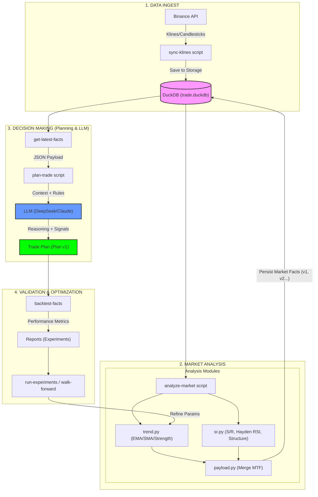

# Trade-Agent Architecture

This document describes the overall logic and data flow of the `trade-agent` system.

## System Architecture Diagram

## Component Breakdown

### 1. Data Ingest
- **`sync-klines`**: Downloads OHLCV data from Binance and stores it in DuckDB.

### 2. Market Analysis
- **`analyze-market`**: The main driver for market analysis.
- **`trend.py`**: Computes trend direction and strength using technical indicators.
- **`sr.py`**: Identifies Support and Resistance levels using specialized logic (Hayden RSI, Structural Swings, and Role Swaps).
- **`payload.py`**: Aggregates multi-timeframe analysis into a structured JSON format.

### 3. Decision Making
- **`plan-trade`**: Combines market facts with trading playbooks to generate a detailed trade plan via LLM.
- **LLM**: Analyzes the provided data to suggest entries, stop losses, and take profits.

### 4. Validation
- **`backtest-facts`**: Runs historical simulations to verify the effectiveness of the generated plans.
- **`run-experiments` & `walk-forward`**: Used for grid searching and testing the stability of strategy parameters across different market regimes.
