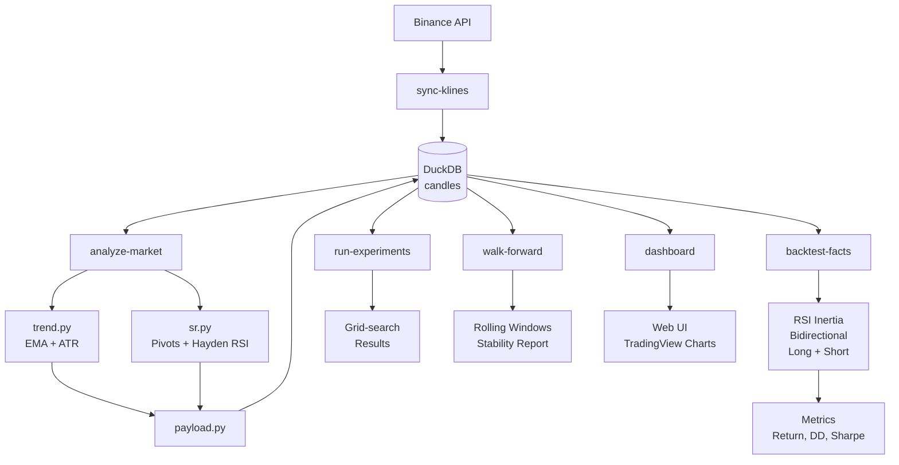

# Trade-Agent Architecture

## System Diagram



## Pipeline

| Stage | Component | Purpose |
|-------|-----------|---------|
| Ingest | `sync-klines` | Download OHLCV candles from Binance → DuckDB |
| Analysis | `trend.py` | EMA crossover, slope, ATR volatility |
| | `sr.py` | Structural pivots (LL/HH), Hayden RSI zones |
| | `payload.py` | Multi-TF merge, bias chain, key levels |
| | `analyze-market` | Run analysis pipeline, persist facts |
| Signal Gen | `facts_strategy.py` | RSI inertia (bidirectional: long + short) |
| Backtest | `backtest-facts` | Vectorized simulation with fee modeling |
| Validation | `run-experiments` | Grid-search params (zone_mult, fee_bps) |
| | `walk-forward` | Rolling train/test windows for stability |
| Visualization | `dashboard` | FastAPI + TradingView charts |

## Strategy: RSI Inertia (Bidirectional)

**Signal Logic:**
```
Long:  idle → momentum (RSI > 80) → correction (RSI < EMA, WMA) → ENTRY (+1)
Short: idle → momentum (RSI < 20) → correction (RSI > EMA, WMA) → ENTRY (-1)
```

**State Machine:**
- IDLE: waiting for momentum setup
- MOMENTUM: RSI extreme (>80 long / <20 short)
- CORRECTION: RSI pullback toward moving averages
- HOLD: active position until divergence or threshold breach
- Divergence: bearish (higher high, lower RSI) exits long; bullish exits short

**Parameters:**
- `rsi_period`: 14
- `ema_period`: 9
- `wma_period`: 45
- `rsi_momentum_long`: 80
- `rsi_momentum_short`: 20
- `rsi_sideway_low`: 40
- `rsi_sideway_high`: 60
- `div_lookback`: 10 bars

## Database Schema

**Tables:**
- `candles`: OHLCV data (symbol, interval, open_time)
- `market_facts`: trend/SR analysis results (symbol, interval, version)
- `backtest_runs`: historical simulation results (run_id, symbol, interval, metrics)
